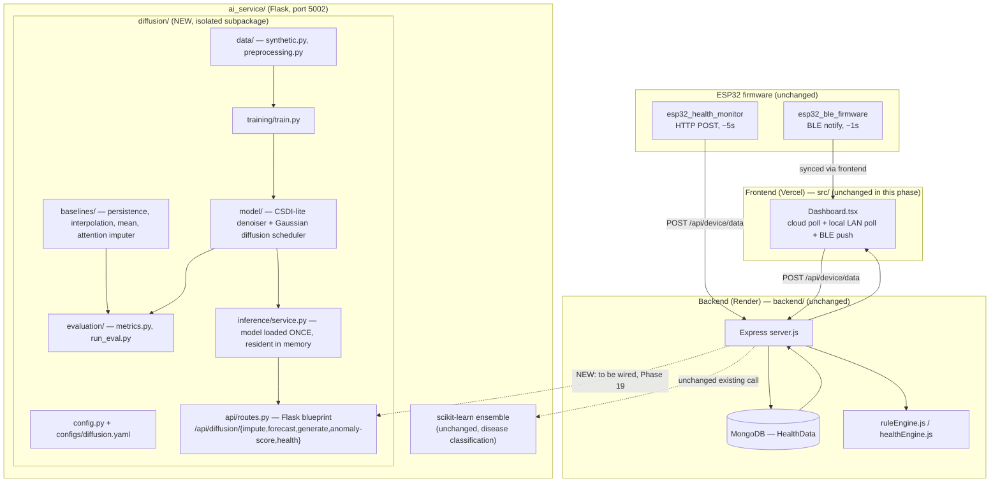

# Architecture — After the Diffusion Component

**What changed (see [MODIFICATION_LOG.md](MODIFICATION_LOG.md) for the
file-by-file table):**

- A new, fully isolated `ai_service/diffusion/` subpackage: its own
  dependencies (`requirements-diffusion.txt`), its own config
  (`configs/diffusion.yaml`), no shared state with the existing
  scikit-learn code.
- `ai_service/app.py` gained exactly one addition — a defensively-imported
  blueprint registration — so that if PyTorch is unavailable in a given
  deployment, the existing `/ai/predict` and `/analyze` routes are
  **provably unaffected** (verified by booting the app and calling both
  the old and new routes in the same process — see IMPLEMENTATION_REPORT.md).
- A new model-resident inference service backing four new endpoints:
  `/api/diffusion/impute` (primary task), `/api/diffusion/forecast` and
  `/api/diffusion/generate` (secondary, same underlying model),
  `/api/diffusion/anomaly-score` (secondary, derived signal for the
  existing alert pipeline, not a replacement for it).
- A mandatory smoke test (`tests/smoke_test_diffusion.py`) and a real
  (non-smoke) evaluation script (`diffusion/evaluation/run_eval.py`)
  comparing the diffusion model against deterministic baselines on
  identical held-out data.

**What did NOT change in this phase:**
- The Node/Express backend (`backend/`) — no new routes were added there
  yet; the diffusion service is reachable directly but not yet proxied
  through the backend (see IMPLEMENTATION_REPORT.md, "Known limitations").
- The React frontend (`src/`) — no UI changes yet; frontend integration is
  scoped as a follow-up phase once the model's real-data performance is
  validated, per the brief's phased approach (item 42, Phase 6 before
  Phase 18).
- The ESP32 firmware — untouched.
- The existing `ai_service/` scikit-learn disease classifier — untouched
  and confirmed still functional.
