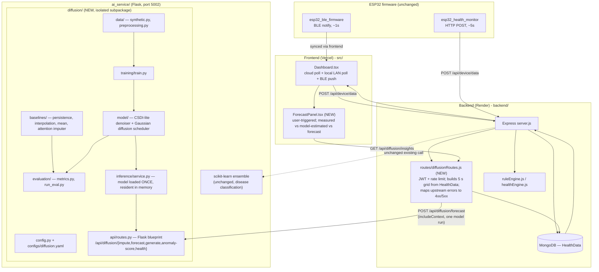

# Architecture — After the Diffusion Component

```mermaid
flowchart TD
    subgraph Firmware["ESP32 firmware (unchanged)"]
        BLE["esp32_ble_firmware\nBLE notify, ~1s"]
        WIFI["esp32_health_monitor\nHTTP POST, ~5s"]
    end

    subgraph FE["Frontend (Vercel) - src/"]
        DASH["Dashboard.tsx\ncloud poll + local LAN poll + BLE push"]
        FP["ForecastPanel.tsx (NEW)
user-triggered; measured vs model-estimated vs forecast"]
    end

    subgraph BE["Backend (Render) - backend/"]
        EXPRESS["Express server.js"]
        PROXY["routes/diffusionRoutes.js (NEW)
JWT + rate limit; builds 5 s grid from HealthData;
maps upstream errors to 4xx/5xx"]
        MONGO[("MongoDB — HealthData")]
        RULES["ruleEngine.js / healthEngine.js"]
    end

    subgraph AI["ai_service/ (Flask, port 5002)"]
        FLASK["scikit-learn ensemble\n(unchanged, disease classification)"]
        subgraph DIFF["diffusion/ (NEW, isolated subpackage)"]
            CFG["config.py + configs/diffusion.yaml"]
            DATA["data/ — synthetic.py, preprocessing.py"]
            MODEL["model/ — CSDI-lite denoiser + Gaussian diffusion scheduler"]
            BASE["baselines/ — persistence, interpolation, mean, attention imputer"]
            EVAL["evaluation/ — metrics.py, run_eval.py"]
            TRAIN["training/train.py"]
            INFER["inference/service.py — model loaded ONCE, resident in memory"]
            API["api/routes.py — Flask blueprint\n/api/diffusion/{impute,forecast,generate,anomaly-score,health}"]
        end
    end

    BLE -->|"synced via frontend"| DASH
    WIFI -->|"POST /api/device/data"| EXPRESS
    DASH -->|"POST /api/device/data"| EXPRESS
    EXPRESS --> MONGO
    EXPRESS --> RULES
    EXPRESS -.->|"unchanged existing call"| FLASK
    EXPRESS --> PROXY
    PROXY -->|"POST /api/diffusion/forecast
(includeContext, one model run)"| API
    PROXY --> MONGO
    DASH --> FP
    FP -->|"GET /api/diffusion/insights"| PROXY
    MONGO --> EXPRESS --> DASH

    TRAIN --> MODEL
    MODEL --> INFER
    INFER --> API
    DATA --> TRAIN
    BASE --> EVAL
    MODEL --> EVAL
```

**What changed (see [MODIFICATION_LOG.md](MODIFICATION_LOG.md) for the
file-by-file table):**

- A new, fully isolated `ai_service/diffusion/` subpackage: its own
  dependencies (`requirements-diffusion.txt`), its own config
  (`configs/diffusion.yaml`), no shared state with the existing
  scikit-learn code.
- `ai_service/app.py` gained exactly one addition — a defensively-imported
  blueprint registration — so that if PyTorch is unavailable in a given
  deployment, the existing `/ai/predict` and `/analyze` routes are
  **provably unaffected** (verified by booting the app and calling both
  the old and new routes in the same process — see IMPLEMENTATION_REPORT.md).
- A new model-resident inference service backing four new endpoints:
  `/api/diffusion/impute` (primary task), `/api/diffusion/forecast` and
  `/api/diffusion/generate` (secondary, same underlying model),
  `/api/diffusion/anomaly-score` (secondary, derived signal for the
  existing alert pipeline, not a replacement for it).
- A mandatory smoke test (`tests/smoke_test_diffusion.py`) and a real
  (non-smoke) evaluation script (`diffusion/evaluation/run_eval.py`)
  comparing the diffusion model against deterministic baselines on
  identical held-out data.

**Also changed since the first version of this document:**

- `backend/routes/diffusionRoutes.js` + `backend/services/diffusionGrid.js`: an
  authenticated, rate-limited proxy. `GET /api/diffusion/insights` reads the
  signed-in user's own `HealthData`, snaps it to a 5-second grid (timing gaps
  become genuine missing values), makes **one** call to the Python service
  and returns gap-filled values plus a forecast with uncertainty bands.
  `POST /api/diffusion/generate` returns clearly flagged synthetic
  sequences; `GET /api/diffusion/status` reports availability.
- `src/components/dashboard/ForecastPanel.tsx` + `src/lib/forecast.ts`: a
  user-triggered panel (no polling; a request takes seconds) that draws
  measured readings, model estimates and the forecast in visibly different
  styles, with a permanent "model-generated, not measurements" label.
- Python service: `/forecast` accepts `includeContext`, `numSamples` and
  `samplingSteps`, so imputation and forecast come from a single pass.
- Bug fixes in existing backend code, made because the integration touches
  it (see MODIFICATION_LOG.md MOD-024): the AI-service URL default pointed
  at the backend's own port, and `HealthData` was queried with the wrong
  field name, which silently disabled trend alerts.

**What did NOT change:**
- The ESP32 firmware (both variants) and `supabase/`.
- The existing `ai_service/` scikit-learn disease classifier and its
  `/ai/predict` and `/analyze` routes.
- The other backend routes. The security issues found in the audit
  (hardcoded admin login, fallback JWT secret, unauthenticated `/uploads` and
  `GET /api/device`) and a signup role-injection hole were fixed later; see
  MODIFICATION_LOG.md MOD-037.
