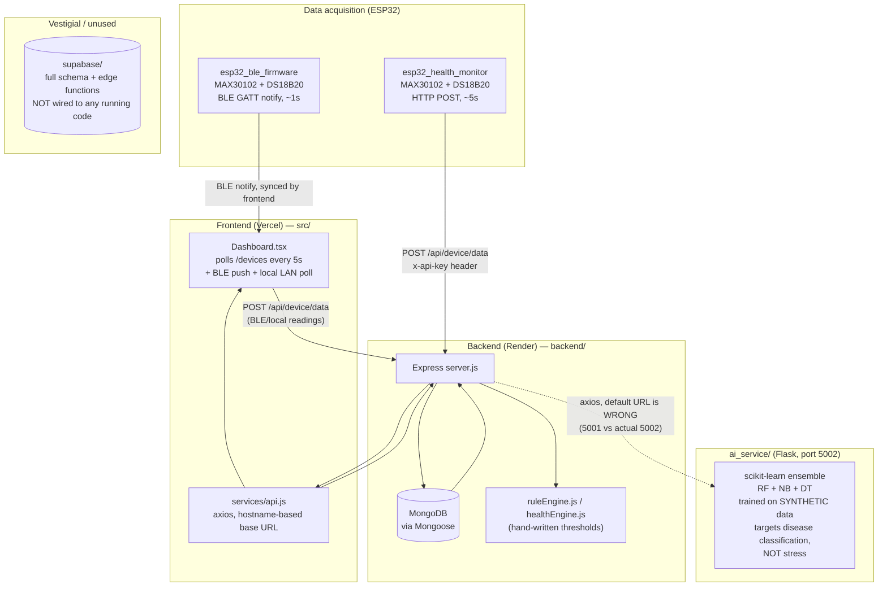

# HealthPulse — Architecture Audit

**Status:** Phase 1-2 deliverable (repository inspection, pre-implementation).
**Method:** Direct source-code inspection (not derived from README claims). Every
claim below is grounded in a specific file; where the audit found a bug,
dead code, or a mismatch between documentation and implementation, it is
called out explicitly rather than smoothed over.

---

## 1. Actual system architecture (as implemented, not as advertised)

The README describes "React, Node.js, Express, MongoDB." That is accurate for
the *primary* path, but the repository contains **two parallel, partially
inconsistent stacks**:



**This replaces the idealized "ESP32 → data acquisition → frontend/backend →
database → AI → dashboard" pipeline** with the more accurate picture above:
two independent firmware transports, a frontend that itself writes to the
database (not just reads), a backend with real rule-based logic but a
disconnected/likely-unreachable ML microservice, and an entirely unused
Supabase schema left over from an earlier scaffold (the project shows signs
of originating from the Lovable.dev platform — see `playwright.config.ts`'s
`lovable-agent-playwright-config` import and the dangling
`supabase.auth.token` reference in `src/lib/tracker.ts:66`).

---

## 2. Component-by-component audit

### 2.1 ESP32 firmware — `esp32_ble_firmware/` and `esp32_health_monitor/`

| | `esp32_ble_firmware/esp32_ble_firmware.ino` | `esp32_health_monitor/esp32_health_monitor.ino` (v2.2) |
|---|---|---|
| **Purpose** | Stream live vitals to the browser directly via Web Bluetooth | Stream vitals to the cloud backend over WiFi/HTTP |
| **Sensors** | MAX30102 (PPG: HR + SpO2), DS18B20 (temp, 1-Wire GPIO 15), SSD1306 OLED | Same sensors, same pins |
| **Transport** | BLE GATT, custom service `12345678-0000-1000-8000-00805f9b3400` | WiFi STA+AP, HTTP POST |
| **Update rate** | JSON characteristic notified every 1000 ms (line ~279) | `SEND_INTERVAL_MS = 5000` |
| **SpO2 estimation** | Crude linear approximation `110.0 - 25.0*ratio`, clamped 70–99.5% (uncalibrated) | Proper quadratic calibration curve (`SPO2_A/B/C`) + 5-sample median/EMA smoothing — materially more accurate |
| **Output format** | `{"heartRate":x,"spo2":x,"temperature":x,"stressScore":x,"stressLevel":"LOW/MODERATE/HIGH","fingerPresent":bool}` | `{"deviceId":"ESP32-HEALTH-001","heartRate":x|null,"spo2":x|null,"temperature":x|null}` |
| **Missingness** | `fingerPresent:false` flags invalid readings | Fields explicitly sent as `null` when invalid — sent only when `fingerPresent && (HR or SpO2 valid)` |
| **Known issues** | Hardcoded MAC address override to defeat Windows BLE caching (hack, not production identity) | Hardcoded WiFi SSID/password and API key in source; hardcoded LAN IP (`192.168.1.5:5001`) as backend target — this firmware cannot reach the production Render backend without a rebuild |

**Location:** `esp32_ble_firmware/esp32_ble_firmware.ino`, `esp32_health_monitor/esp32_health_monitor.ino`
**Dependencies:** SparkFun `MAX30105`, `OneWire`, `DallasTemperature`, `Adafruit SSD1306`, `BLEDevice` (Arduino/ESP32 core)
**Data format:** JSON over BLE notify or HTTP POST body.
**Limitation for ML purposes:** the two firmware variants disagree on sampling cadence (1s vs 5s) and on SpO2 accuracy. Any physiological model trained on server-side data inherits whichever firmware a given device is running — **sampling interval is not a fixed system constant**, it is per-device/per-firmware.

### 2.2 Backend — `backend/`

**Purpose:** REST API, auth, data persistence, rule-based health/alert logic.
**Technology:** Express 4, Mongoose (MongoDB), JWT auth, deployed on Render.
**Entry point:** `backend/server.js` — single-file bootstrap, no MVC framework beyond `require`-based route mounting.

**Middleware stack (in order):** `helmet()` → CORS allow-list → `express.json()` → three separate `express-rate-limit` instances (general/report/device) → a bare `console.log` request logger (no redaction — logs full URLs including any `?token=` query strings in plaintext).

**Database:** MongoDB only. Confirmed by: `mongoose.connect(process.env.MONGO_URI)` in `server.js:111`; every model under `backend/models/*.js` uses `mongoose.Schema`; `backend/package.json` has no Supabase dependency; grepping `backend/` for "supabase" returns zero matches.

**Collections (Mongoose schemas, `backend/models/`):**

| Collection | Key fields | Notes |
|---|---|---|
| `HealthData` | `userId` (ObjectId), `deviceId` (String), `heartRate`, `spo2`, `temperature`, `createdAt` | **The physiological time series.** One document per reading. Compound index `{userId:1, createdAt:-1}`. |
| `HealthAnalysis` | `user_id`, `condition`, `healthScore`, `riskLevel`, `dominantDosha`, `type`, `sensorData:{heartRate,spo2,temperature}`, `alerts[]`, `criticalFlags[]` | Snapshot of a single triggering analysis, not a series. |
| `Report` | `extractedData[]` (lab values), `analysis`, `contextUsed.sensorSnapshot`, `filePath` | Uploaded blood-report OCR/manual-entry results. |
| `Alert` | `user_id`, `message`, `severity`, `resolved`, `strict:false` | |
| `User` | `email`, `password` (bcrypt), `role`, `strict:false` | |
| `Device` | `deviceId`, `status`, `lastSeen` | **No `user_id` field**, despite `deviceController.js` querying `Device.find({user_id:...})` — see limitations. |
| `UserDevice` | `userId`, `deviceId` (unique compound) | User↔device linking table. |
| `OnboardingData` | `user_id` (unique), rest `strict:false` | Real onboarding fields (symptoms, lifestyle, etc.) are schemaless — only discoverable by grepping `ruleEngine.js`/`healthEngine.js` usage. |
| `TrackEvent` | analytics beacon fields | |
| `Feedback` | `user_id`, `rating`, `comment` | |

**API surface (representative, grouped by feature):**

- **Auth:** `POST /api/auth/register`, `POST /api/auth/login` (contains a hardcoded `admin`/`admin@@@123` backdoor — `authController.js:35`), `GET /api/auth/user`.
- **Health ingestion:** `POST /api/device/data` (the core ESP32 ingestion endpoint — validates HR 30–220, SpO2 0–100, Temp 30–45°C, inserts one `HealthData` doc, fires async analysis), `GET /api/health` (last 20 docs), `GET /api/device/:userId` (last 20 docs), `POST /api/device/register`, `POST /api/device/connect`, `GET /api/device` (**no auth**).
- **AI/analysis:** `POST /api/ai/analyze` (fuses onboarding + latest report + latest vitals through `informaticsService.js`, a rule engine), plus LLM-proxy routes (`aiAgentRoutes.js`, `deepseekRoutes.js`, `doctorAiRoutes.js`, `dermatologyRoutes.js`) that call external LLM APIs (Groq/Grok/DeepSeek), not the local `ai_service`.
- **Reports:** `POST /api/reports/upload` (multer, PDF/image → OCR via `tesseract.js`), `POST /api/reports/manual`, `GET /api/reports`.
- **Alerts:** `GET /api/alerts`, `PATCH /api/alerts/:id/resolve`.
- **Admin:** `/api/admin/*` — analytics, user management, CSV export (token passed in URL query string — a minor credential-leak pattern), feedback moderation.

**Auth mechanism:** Stateless JWT (`jsonwebtoken`), `Authorization: Bearer <token>` or `?token=` query param. Device endpoints accept either `x-api-key: DEVICE_API_KEY` or a Bearer JWT. **Hardcoded JWT fallback secret** (`"healthpulse_fallback_secret_2026_secure_default"`) is used whenever `JWT_SECRET` is unset — present in three files.

**Config/env vars actually read in code:** `MONGO_URI`, `PORT`, `FRONTEND_URL`, `JWT_SECRET`, `DEVICE_API_KEY`, `AI_SERVICE_URL` (default `http://localhost:5001` — **mismatched** with the Flask service's actual port 5002), `GROQ_API_KEY`, `GROK_API_KEY`, `DEEPSEEK_API_KEY`. No `.env.example` exists anywhere in the repo.

**In-backend rule-based "AI" (not the Flask service):**
- `ruleEngine.js` — hardcoded thresholds (HR>120 + chest pain → cardiac emergency; SpO2<92 → respiratory distress).
- `healthEngine.js` — weighted point scoring for `riskLevel` (critical=40pts, high=20, moderate=10 → thresholds at 40/20/10). Trend detection requires ≥3 recent readings, but **`services/healthService.js:18` queries `HealthData.find({user_id:...})` while the schema field is `userId`** — this field-name mismatch means the query returns zero documents in production, so trend-based alerting is silently dead.

**Deployment:** Vercel (frontend, `vercel.json` is just an SPA rewrite rule) + Render (backend, `https://health-931r.onrender.com`). No Docker, no CI/CD config anywhere in the repo.

**Tests:** `backend/` has no dedicated test directory found; root-level `test-backend.js`, `test-login.js`, `test-render*.js` are one-off manual probe scripts (plain `http.get`/`axios` calls with `console.log`, no assertions, not wired into any test runner). The real automated test tooling is `vitest` (frontend) and `playwright` (e2e scaffold, via Lovable's config, no `.spec.ts` files found).

**Notable limitations found in code (not invented):**
1. Hardcoded admin login backdoor (`authController.js:35`).
2. Hardcoded JWT fallback secret (3 files).
3. `HealthData` query field-name bug silently disables trend alerts (`healthService.js:18`).
4. `deviceController.js` queries a `Device.user_id` field that doesn't exist in the schema, and the controller isn't mounted on any route anyway (dead code).
5. `config/db.js`'s `connectDB()` is defined but never called — the real connection logic is duplicated inline in `server.js` with no fallback URI.
6. `/uploads` (containing real uploaded medical report PDFs/images) is served via `express.static` with **no authentication**.
7. `GET /api/device` (lists all devices) has no auth.
8. Request logger writes full URLs, including query-string JWTs, to stdout unredacted.
9. `AI_SERVICE_URL` default port (5001) does not match the Flask service's actual port (5002) — the Node→Python integration is likely silently broken in most deployments (it fails soft: `healthService.js` wraps the call in try/catch and falls back).

### 2.3 AI service — `ai_service/`

**Purpose (as implemented — differs from what an "AI Powered Wearable Health Monitoring" README implies):** a standalone Flask microservice that classifies **lab-report values** (hemoglobin, WBC, platelets, glucose, TSH, ESR) into one of 5 disease categories (Anemia / Diabetes Risk / Thyroid Imbalance / Infection-Inflammation / Normal). **It does not do stress analysis, and it does not consume physiological time series** — its only physiological inputs are three scalar features (`heartRate`, `spo2`, `temperature`) folded into a single 17-element feature vector per request, used only to derive binary flags like `stress_flag = heartRate > 90` (`app.py:53`, `trainer.py:76`).

**Technology:** Python, Flask + flask-cors, scikit-learn (`RandomForestClassifier`, `GaussianNB`, `DecisionTreeClassifier`) combined via majority vote, `joblib` for persistence, `pandas`/`numpy`. No PyTorch/TensorFlow/deep learning anywhere in the repo.

**Training data:** `trainer.py` generates its training set with `np.random.normal(...)` — **entirely synthetic**, explicitly commented "In lieu of a direct Kaggle/UCI download... we generate a robust synthetic clinical dataset" (`trainer.py:18-19`). Trained artifacts (`rf_model.joblib`, `nb_model.joblib`, `dt_model.joblib`, `imputer.joblib`, `scaler.joblib`, `feature_names.joblib`) exist in `ai_service/models/` and are real (not stubs), but were never fit on real patient data.

**Endpoints:**
- `POST /ai/predict` — the real ensemble classifier, single-shot JSON in, disease/confidence/clinical-flags out. Not a time-series endpoint.
- `POST /analyze` — explicitly commented `"Existing compatibility stub"` — returns a hardcoded dummy payload (`healthScore: 85`, empty recommendations) except for a rule-based emergency check.

**Integration with Node backend:** plain HTTP via axios (`backend/services/healthService.js:52`), wrapped in a 3-second-timeout try/catch that silently falls back on failure — and given the port mismatch noted above (backend defaults to 5001, Flask listens on 5002), this call likely fails and falls back in most real deployments unless `AI_SERVICE_URL` is manually set. Separately, `aiRoutes.js` has a comment claiming it calls "Python /ai/predict (ensemble ML)" but its actual code path calls a local Node function (`informaticsService.js`) instead — the comment is stale/inaccurate.

**Stress logic elsewhere (not in `ai_service`):** two independent, non-ML implementations —
- `src/lib/stress.ts` (frontend, TypeScript): pure weighted arithmetic over HR/temp/symptom-count/sleep-hours, computed client-side, never touches a model.
- `backend/services/predictionService.js`: self-described in a comment as using a **"Weighted Decision Forest" algorithm "inspired by Random Forest/XGBoost"** — in reality this is a hand-written `if`/`else` point-scoring heuristic with no `.fit()` call and no persisted weights. The name is misleading; there is no trained model behind it.
- A second orphaned script, `ai_service/mental_health_trainer.py`, references a nonexistent CSV (`Digital_Mental_Health_Dataset_200000.csv`) and has never successfully produced its target `mental_health_model.pkl` (absent from `models/`) — dead/unfinished code, not wired into `app.py`.

**Dependencies:** `ai_service/requirements.txt` — `flask`, `flask-cors`, `scikit-learn`, `joblib`, `pandas`, `numpy`, `requests`.
**Tests:** none found.
**Bottom line:** there is no existing time-series ML component, and no existing stress model, anywhere in the repository. The diffusion work is a greenfield ML addition, not an upgrade of something already working.

### 2.4 Frontend — `src/`

**Purpose:** React 18 + TypeScript + Vite SPA, dashboard for live/historical vitals, report upload/analysis, alerts, admin panel.

**Routing:** `react-router-dom` v6, `ProtectedRoute`/`AdminRoute` wrappers (`src/lib/auth.tsx`). **State management:** no Redux/Zustand; React Query is initialized but effectively unused (no page calls `useQuery`); all data fetching is `useState`/`useEffect` + manual `setInterval` polling.

**API client:** `src/services/api.js` — single axios instance whose base URL is chosen by `window.location.hostname` (`localhost` → `http://localhost:5001/api`, else the Render URL), **not** driven by `VITE_API_URL` — while two other files (`AdminDashboard.tsx`, `MapPage.tsx`) *do* separately read `VITE_API_URL`. Two different URL-resolution strategies coexist.

**Data acquisition into the frontend (three concurrent paths, all converging on the same `HealthData` collection):**
1. **Cloud poll:** `Dashboard.tsx` calls `api.get("/devices")` / `api.get(/device/${user.id})` every 5000 ms.
2. **Local LAN poll:** direct `axios.get(http://${ip}/data?key=ESP32_KEY)` against the ESP32's own HTTP server, then synced up to the cloud via `api.post("/device/data", ...)`.
3. **BLE push:** `src/lib/ble.ts`'s `bleManager.onData(...)` subscription (real push via Web Bluetooth notify, polling fallback at 1000 ms if notify setup fails), also synced to `/device/data`.

**Key data types (as defined in code, not inferred):**
```ts
// src/pages/Dashboard.tsx
interface HealthReading { heart_rate: number; spo2: number; temperature: number; timestamp: string; }

// src/lib/ble.ts
interface BLEHealthData {
  heartRate: number; spo2: number; temperature: number;
  stressScore: number; stressLevel: string; rmssd: number;
  fingerPresent: boolean; timestamp: number; raw: string;
}
```
AI-analysis results are consumed as untyped `any` everywhere in the frontend — no shared TypeScript interface exists for the AI/analysis response shape.

**Historical vs. real-time distinction:** informal, not backed by a dedicated history API. `latest` (single reading) drives live gauges; `readings` is a client-side array **capped at the last 20 points** (`prev.slice(-19)` pattern), fed into `recharts` `AreaChart`/`LineChart` in `AnalyticsPanel.tsx`. There is no pagination, date-range picker, or server-side downsampling anywhere.

**Charting library:** `recharts` v2 — the only chart library in use, plus a generic shadcn/ui `chart.tsx` wrapper. This is the natural place to plug in a forecast/imputation visualization later (Phase 18), reusing the existing `AreaChart`/`CustomTooltip` pattern.

**Cosmetic/mock content worth flagging (not real sensor data):** `AnalyticsPanel.tsx` renders a fabricated "Live ECG Waveform" (procedurally generated SVG path, not derived from any sensor) and a hardcoded scrolling list of fake "Real-Time Sensor Logs" strings. `ReportUpload.tsx`'s skin-scan feature explicitly simulates a 2.5s delay and returns a hardcoded `condition_name`/`confidence_score`, commented `"in production, this would be a real ML model call"`.

**Env vars:** only `VITE_API_URL` (used inconsistently, see above). No `.env`/`.env.example` file exists at the repo root.

### 2.5 `supabase/` — vestigial, not wired to any running code

Contains a full Postgres schema (`profiles`, `user_roles`, `onboarding_data`, `devices`, `health_data`, `reports`, `alerts`) and 3 Deno edge functions. **This is dead weight, not an active data path.** Evidence: no `@supabase/supabase-js` dependency in either `package.json`; zero references to Supabase in `backend/`; the only reference in `src/` is one dead `localStorage.getItem('supabase.auth.token')` line that is never populated because no Supabase client is ever instantiated; the README states the real stack is Node/Express/MongoDB; neither ESP32 firmware targets Supabase. It appears to be leftover scaffold from the project's origin (Lovable.dev), not a parallel production backend. **The diffusion work must not assume this schema is live.**

---

## 3. System-wide limitations relevant to adding ML

1. **No existing time-series ML infrastructure** to build on — the diffusion service is greenfield.
2. **Sampling cadence is not a fixed constant** — it differs by firmware variant (1s BLE vs 5s WiFi) and is further irregular in practice whenever a user's finger leaves the sensor (explicit `null`/`fingerPresent:false` gaps).
3. **No dedicated stress ground truth** — all "stress" values in the system today are heuristic outputs, not measurements, so a diffusion model cannot be validated against a trustworthy stress label without new instrumentation (e.g., HRV/`rmssd`, which the BLE firmware already computes on-device and could be a better proxy signal than the heuristic score).
4. **No server-side history/windowing endpoint** exists yet — anything a diffusion service needs (e.g., "last N minutes of readings for user X") must be added as a new backend endpoint or queried directly against `HealthData` by the ML service.
5. **The existing `ai_service/` Flask app is a plausible host** for a new ML capability (same language ecosystem, same deployment shape) but currently solves an unrelated problem (lab-value classification) and has a live wiring bug (port mismatch) that should be fixed regardless of the diffusion work, or explicitly worked around.

See [DATA_PIPELINE.md](DATA_PIPELINE.md) for the detailed physiological data-format findings that drive model design, and [MODEL_SELECTION.md](MODEL_SELECTION.md) for how these constraints shaped the architecture choice.
