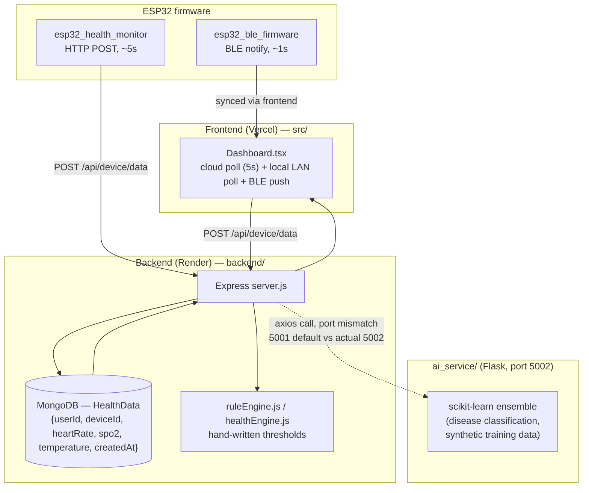

# Architecture — Before the Diffusion Component

This reflects the repository exactly as cloned, before any of this
project's changes (see [ARCHITECTURE_AUDIT.md](ARCHITECTURE_AUDIT.md) for
the full narrative version of this diagram).

**Characteristics:**
- No time-series ML component of any kind exists.
- "Stress" is computed by hand-written heuristics in two places
  (`src/lib/stress.ts` on the frontend, `backend/services/predictionService.js`
  on the backend) — neither is a trained model.
- The only trained ML artifacts (`ai_service/models/*.joblib`) solve an
  unrelated problem (lab-value disease classification) and were trained
  entirely on synthetic data generated with `np.random.normal`.
- The Node↔Flask integration has a live port-mismatch bug
  (`AI_SERVICE_URL` defaults to 5001; Flask listens on 5002), so in most
  deployments the call silently fails and falls back.
- No forecasting, imputation, generation, or anomaly-scoring capability
  exists anywhere in the system.

See [ARCHITECTURE_AFTER.md](ARCHITECTURE_AFTER.md) for what changed.
